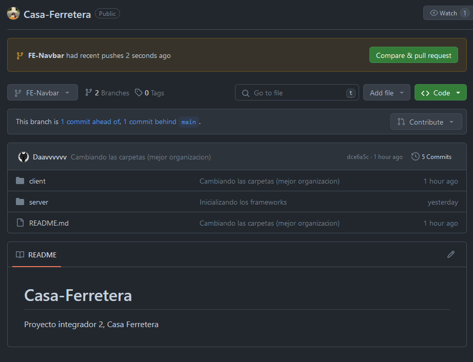

# Casa-Ferretera
Proyecto integrador 2, Casa Ferretera


# Instrucciones para hacer PR


Se debe estar en el repositorio respectivo donde esta el archivo .git, es decir, en el caso del proyecto en cuestion, se debe
estar en la carpeta <b>CASA-FERRETERA</b> una vez ahi, se ejecutan los siguientes comandos

<b>Si la branch no esta creada se deben seguir los siguientes pasos</b>

```
git checkout -b [NOMBRE DE LA RAMA]

```

Una vez hecho esto, se deben asegurar que si esten ubicados en la rama que es

```
git add .
git commit -m "[EL TITULO QUE SE QUIERA PONER A LA PULL REQUEST]"
git push origin [NOMBRE DE LA RAMA]

```

<b>EN EL CASO EN EL QUE YA SE HAYA CREADO LA RAMA EN LA QUE ESTEN TRABAJANDO SE HACE LO SIGUIENTE</b>


```
git branch (Se podran ver las diferentes ramas del repositorio)
git checkout [NOMBRE DE LA RAMA]
git add .
git commit -m "[EL TITULO QUE SE QUIERA PONER A LA PULL REQUEST]"
git push origin [NOMBRE DE LA RAMA]

```

Una vez que los pasos anteriores ya esten hechos se tiene que entrar a GitHub al repositorio de Casa Ferretera y va a aparecer una opcion que dice 



Al clickear en el boton se debe agregar una descripcion detallada sobre los cambios hechos en el repositorio.